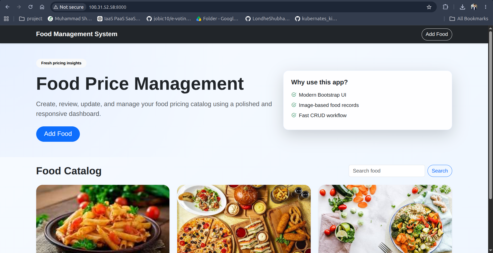

# Food App - 2-Tier Kubernetes Deployment 🚀



This repository contains production-ready Kubernetes (K8s) manifest files to deploy and manage a Dockerized Django Food Management Application. The infrastructure architecture is designed as a secure, scalable, and highly available **2-Tier Infrastructure Layer** running inside an isolated Kubernetes workspace.

---

## 🏗️ 2-Tier Architecture Design

### 🔹 Tier 1: Web Application Layer (Frontend/Backend)
- **Django Application Engine:** Powered by a custom Docker image (`shahiddevops1/food-app-app`) containerizing the Django application.
- **Automated Schema Lifecycle:** Implements an `initContainer` to automatically execute Django database migrations (`python manage.py migrate`) *before* the primary web server starts. This sequence eliminates application crashes caused by starting the server before the database schema is ready.
- **External Routing:** Exposes the application to external traffic via a `NodePort` service mapping traffic internally on port `8000` and exposing it on external node port `30007`.

### 🔹 Tier 2: Database Layer (Stateful Backend)
- **MySQL Database Engine:** Powered by the official `mysql:8.4` engine image optimized for performance and security.
- **Data Persistence (PVC):** Bound with a `PersistentVolumeClaim` (1Gi storage allotment) to guarantee data persistence. Your backend food logs and transactions remain intact even if database pods are killed, rescheduled, or upgraded.
- **Internal Discovery:** Uses a secure `ClusterIP` network service (`mysql-service` on port `3306`) ensuring the database tier is private and only accessible internally by the Tier 1 application layer.

---

## ⚙️ Core Kubernetes Features Implemented
- **Workspace Boundary (Namespace):** Everything runs inside the `food-management` workspace, preventing resource leaks into the cluster's default namespace.
- **Decoupled Architecture:** Strict separation of data and logic. Configurations like whitelisted hosts (`ALLOWED_HOSTS`) live in a `ConfigMap`, while master credentials stay hidden inside encrypted native K8s `Secrets`.

---

## 📂 Project Directory Structure
```text
food-app-k8s-deployment/
│
├── screen.png            # Application preview screenshot (Top banner)
├── .gitignore            # Keeps db-secrets.yaml safe from leakages
├── README.md             # Complete project setup documentation
│
└── k8s/                  # Kubernetes Manifest Directory
    ├── namespace.yml   # Workspace Boundary Setup
    ├── db-secrets.yaml # Secure Database Passwords (Git-Ignored)
    ├── configmap.yaml  # App Environment Mapping & Whitelists
    ├── mysql.yaml      # [Tier 2] DB Deployment, PVC, & ClusterIP Service
    └── app.yml         # [Tier 1] Web Engine Deployment & NodePort Routing
```

---

## 🚀 How to Deploy Step-by-Step

Follow these commands in sequence to stand up the 2-Tier infrastructure layer on your remote cluster environment (e.g., AWS EC2 with Minikube/Kind):

### 1. Project Initialization & Network Isolation
Clone the repository and set up your workspace context layer:
```bash
git clone https://github.com
cd food-app-k8s-deployment

# Apply Namespace Workspace
kubectl apply -f k8s/namespace.yml
```

### 2. Configuration & Secrets Mapping
Apply your credential abstractions. Ensure `db-secrets.yaml` is configured properly:
```bash
kubectl apply -f k8s/db-secrets.yaml
kubectl apply -f k8s/configmap.yaml
```

### 3. Spin Up Backend Storage Engine [Tier 2]
Deploy the stateful persistent volume claim along with your MySQL server:
```bash
kubectl apply -f k8s/mysql.yaml
```
*Wait approximately 10-15 seconds for the MySQL stateful container hooks to become healthy.*

### 4. Fire Up Web Application Engine [Tier 1]
Apply the web deployment containing your database migrations init-hook and external networking routing service:
```bash
kubectl apply -f k8s/app.yml
```

### 5. Verification & Runtime Health Check
Verify that both tier components are synchronized, bound, and in an active `Running` status:
```bash
kubectl get pods -n food-management
```

---

## 🌐 How to Access the Live Application Dashboard

Since this architecture exposes traffic dynamically, use the built-in port-forwarding feature to pipe remote traffic directly into your environment namespace safely:

```bash
kubectl port-forward svc/food-app-service 8000:8000 -n food-management --address 0.0.0.0
```
*Keep this terminal running.* Open your favorite local web browser and log into:
```text
http://<YOUR-EC2-PUBLIC-IP>:8000
```
*(Ensure that Port `8000` is allowed in your AWS EC2 Security Groups Inbound rules to receive inbound web browser calls).*
